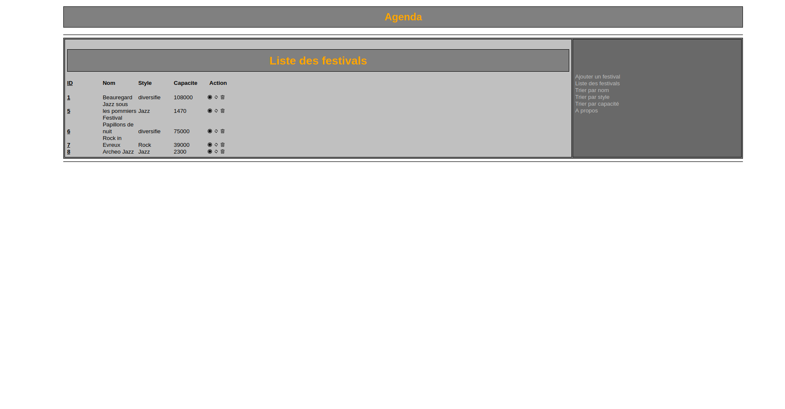
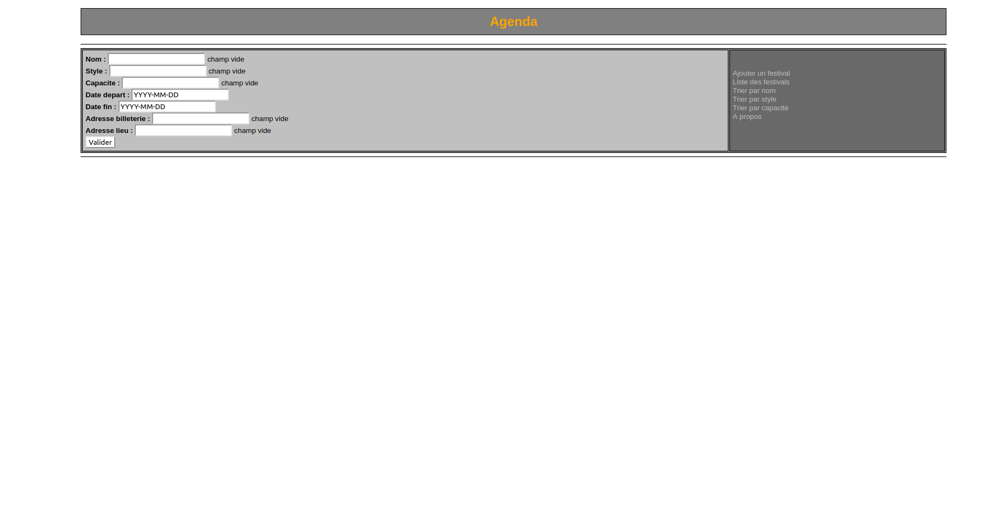
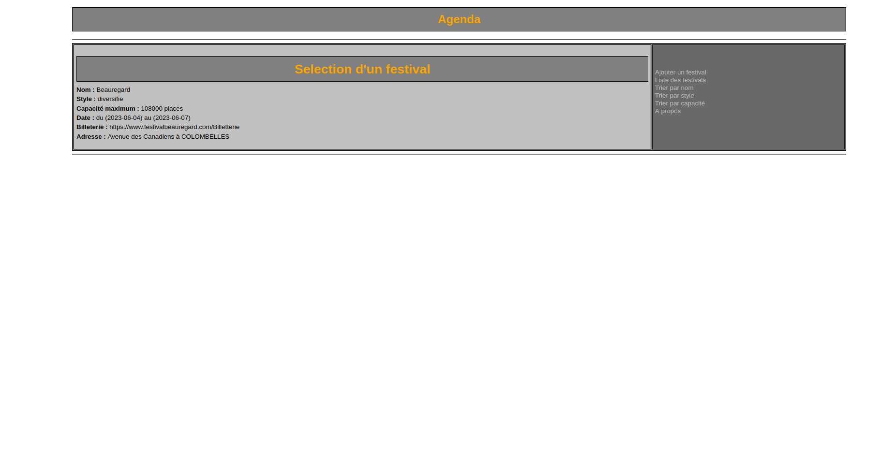
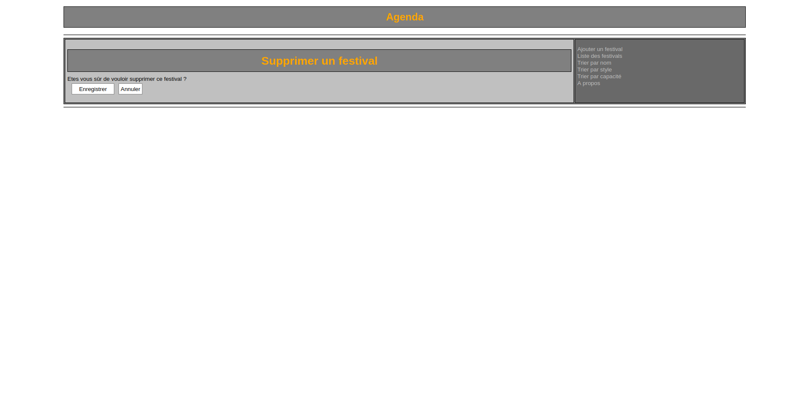

# Festival-Website
A website that catalogs music festivals, developed using HTML, CSS, PHP, and MySQL. I implemented a MySQL database that can be populated through a user-submitted form. The list of festivals can be sorted by name, genre, or maximum capacity. Each festival entry can be viewed, edited, or deleted directly from the website by users. As with my website previous project, I focused on implementing the database functionalities rather than the visual design.

# Images
<table>
	
  <tr>
  	<td></td>
    <td></td>
    <td></td>
  </tr>
</table>
